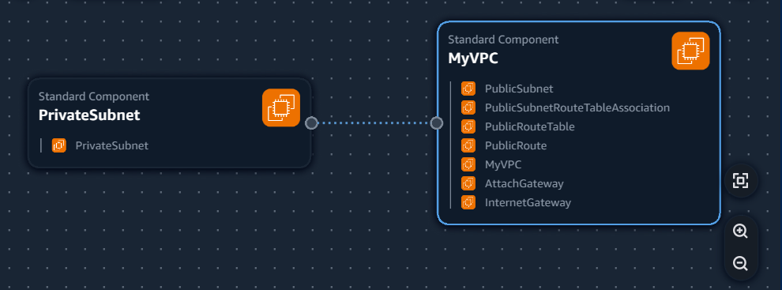
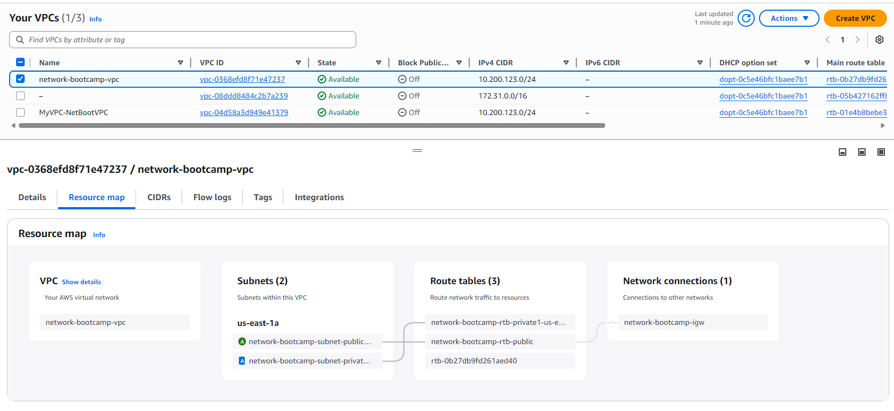

## Journaling

## VPC Settings

These are the VPC settings we observed Tim set up for the cloud environment in AWS:
VPC IPv4 - CIDR Block: 10.200.123.0/24
IPv6 CIDR Block: No
Number of AZs: 1
Number of public subnets: 1
Number of private subnets: 1
NAT Gateways: None
VPC Endpoints: None
DNS Options: Enable DNS Hostnames
DNS Options: Enable DNS Resolution

## Generated and reviewed CFN Template

Watching the instructor video, I noted the VPC settings, provided this to LLM to produce the CFN template to automate the provision of the VPC infrastructure. I reviewed the CFN template and refactored it to best practices.

- Asked LLM to refactor the parameters so that values weren't hardcoded

## Generated deploy script

Using LLM, generated a bash script `bin/deploy`
Changed shebang to work on all cloud script

## Visualization in Infrastructure Composer

Trying to use Infra Composer extention to visualise the VPC:

## Installing AWS CLI

In order to deploy via the AWS CLI, we need to install it.

We follow the install instructions:
[AWS CLI Installation](https://docs.aws.amazon.com/cli/latest/userguide/getting-started-install.html)

## Deployed Resource to AWS

This is the resource map of the VPC deployed with CFN

